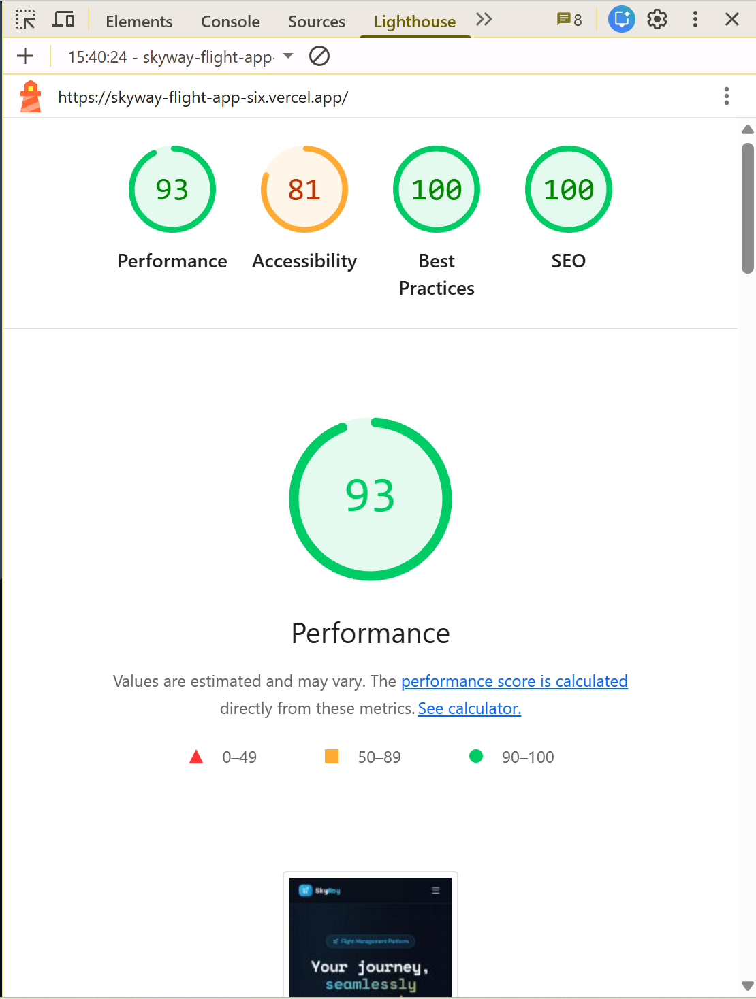

# ✈️ SkyWay — Flight Management PWA

A production-grade flight management web application built with Next.js 14+, Supabase, Zustand, and Tailwind CSS.

**Live demo:** https://skyway-flight-app-six.vercel.app

---

## Features

- **Flight search** — origin, destination, date, passenger count
- **Interactive seat map** — colour-coded by class with live Supabase Realtime updates
- **Booking flow** — seat reservation via RPC (prevents double-booking race conditions)
- **My Bookings** — full history with status badges
- **Reschedule** — pick alternative flight on same route; fee auto-calculated
- **Cancel** — atomic RPC cancels booking + releases seat; blocked within 2 hrs of departure
- **Auth** — Supabase Auth with Row Level Security on all tables
- **PWA** — installable, offline fallback, StaleWhileRevalidate caching
- **Zustand** — persist middleware with `partialize` to exclude passport numbers from localStorage

---

## Tech Stack

| Layer | Technology |
|---|---|
| Frontend & routing | Next.js 16 (App Router, Server Components) |
| Database & Auth | Supabase (PostgreSQL + RLS + Realtime) |
| State management | Zustand + persist middleware |
| Styling | Tailwind CSS + inline CSS variables |
| PWA | next-pwa |

---

## Local Setup

### 1. Clone & install

```bash
git clone https://github.com/Yash-Swarup/skyway-flight-app
cd skyway-flight-app
npm install
```

### 2. Create a Supabase project

1. Go to [supabase.com](https://supabase.com) → New project
2. Copy your **Project URL** and **anon key** from Settings → API

### 3. Configure environment

```bash
cp .env.example .env.local
# Fill in your NEXT_PUBLIC_SUPABASE_URL and NEXT_PUBLIC_SUPABASE_ANON_KEY
```

### 4. Run migrations & seed

In the Supabase SQL Editor, run in order:

```
supabase/migrations/001_initial_schema.sql
supabase/migrations/002_seed.sql
```

This creates all tables, RLS policies, RPC functions, 8 flights across 4 routes, and a full seat map per flight.

### 5. Enable Realtime

In Supabase dashboard → Database → Replication, enable the `seats` table.

### 6. Create test user

In Supabase → Authentication → Users → Add user:
- **Email:** `test@skyway.dev`
- **Password:** `skyway123`

### 7. Run the dev server

```bash
npm run dev
```

Open [http://localhost:3000](http://localhost:3000).

---

## Supabase Configuration Notes

- **Row Level Security** is enabled on all 5 tables. Flights and seats are publicly readable (anon key). Bookings, passengers, and reschedules are owner-only (`auth.uid() = user_id`).
- **`reserve_seat(p_seat_id, p_flight_id)`** — SECURITY DEFINER RPC that locks the seat row with `FOR UPDATE` before marking it unavailable, preventing double-booking under concurrent requests.
- **`cancel_booking(p_booking_id)`** — atomically sets booking status to `cancelled` and flips `seat.is_available = true`. Rejects cancellations where `departs_at - NOW() < 2 hours` at the database level.
- **Realtime** is enabled on the `seats` table so the seat map updates live without a page refresh.

---

## Zustand Store Structure

### `useFlightStore` — `/stores/flightStore.ts`

| Key | Type | Persisted |
|---|---|---|
| `searchQuery` | `SearchParams \| null` | ✅ |
| `selectedFlight` | `Flight \| null` | ✅ |
| `selectedSeat` | `Seat \| null` | ✅ |
| `currentStep` | `BookingStep` | ✅ |
| `optimisticSeatId` | `string \| null` | ✅ |
| `passengerForm` | `PassengerForm` | ❌ (contains passport_no) |

`partialize` explicitly excludes `passengerForm` so passport numbers are never written to `localStorage`.

Optimistic seat selection: `setSelectedSeat` immediately sets `optimisticSeatId` in the store before the Supabase `reserve_seat` RPC responds. If the RPC fails, the error is shown and the user can pick another seat.

`resetBooking()` is called after successful booking or cancellation. `resetAll()` is triggered on logout via the `AuthProvider`.

### `useUserStore` — `/stores/userStore.ts`

| Key | Persisted |
|---|---|
| `user` (full object) | ❌ |
| `session` (access + refresh token only) | ✅ |
| `cachedBookings` | ✅ (for offline My Bookings) |

---

## Database Routes

| Route | Flights |
|---|---|
| Delhi → Mumbai | SA101, SA102 |
| Mumbai → Delhi | SA201, SA202 |
| Bangalore → Hyderabad | SA301, SA302 |
| Hyderabad → Bangalore | SA401, SA402 |

Aircraft: A320 / Boeing 737 (6-wide, 30 rows), ATR 72 (4-wide, 18 rows).
Classes: First (rows 1–2), Business (rows 3–6 / 3–4), Economy (rest).

---

## Project Structure

```
app/
  page.tsx                  # Homepage with search form
  auth/login/               # Login page
  auth/register/            # Register page
  search/                   # Flight results (Server Component)
  flights/[id]/seats/       # Seat selection
  flights/[id]/book/        # Passenger details + booking confirmation
  bookings/                 # My Bookings list (Server Component, offline-cached)
  bookings/[id]/            # Booking detail + reschedule/cancel
  offline/                  # PWA offline fallback

components/
  ui/                       # Navbar, AuthProvider, InstallBanner
  flight/                   # FlightSearchForm, FlightCard
  seat/                     # SeatMap, SeatPageClient
  booking/                  # BookPageClient, BookingDetailClient

stores/
  flightStore.ts            # Active booking flow state
  userStore.ts              # Auth session + cached bookings

lib/supabase/
  client.ts                 # Browser client (SSR-safe)
  server.ts                 # Server Component client

supabase/migrations/
  001_initial_schema.sql    # Tables, RLS, RPCs, Realtime
  002_seed.sql              # 8 flights + full seat maps
```

---

## Deploy to Vercel

```bash
npx vercel --prod
```

Set the same env vars (`NEXT_PUBLIC_SUPABASE_URL`, `NEXT_PUBLIC_SUPABASE_ANON_KEY`) in the Vercel project settings.

---

## Trade-offs & What I'd Do Differently

- **Payment flow** — currently skipped; in production I'd integrate Razorpay/Stripe before confirming a booking.
- **Multi-passenger booking** — the current flow books one passenger per booking. The schema supports multiple rows in `passengers`, but the UI only collects one.
- **Email confirmation** — Supabase Edge Functions would send a booking confirmation email with the PNR.
- **Seat map for ATR vs widebody** — the grid adapts between 4-column and 6-column layouts based on `aircraft_type`, but doesn't yet render first/business cabin dividers visually as separate cabin sections on wide screens.
- **Testing** — I'd add Playwright E2E tests for the full booking flow and Vitest unit tests for the Zustand stores and RPC behaviour.

## Lighthouse Scores


